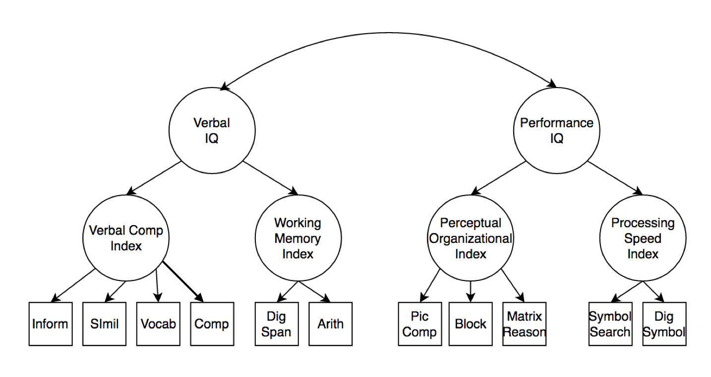

```{r setup, include=FALSE}
knitr::opts_chunk$set(echo = TRUE)
```

## CFA Assignment

### The Data and Libraries 

Import the dataset for this assignment (included online), and load the `lavaan` and `semPaths` libraries. 

```{r}
library(lavaan)
library(semPlot)

data <- read.csv("assignment3_data.csv")
names(data)[1] <- "inform"
```

### Data screening (shortened):

Assume that the data is accurate. Screen the data for outliers.

```{r}
mahal = mahalanobis(data,
                    colMeans(data),
                    cov(data))
cutoff = qchisq(1-.001, ncol(data))
outputTable = table(mahal < cutoff)
```

QUESTION: How many outliers did you have? \
ANSWER: $`r outputTable["FALSE"][1]`$

Exclude any multivariate outliers.

```{r}
data2 = subset(data, mahal < cutoff)
```

### Confirmatory Factor Analysis

The picture for this assignment is included on Canvas. If you download it into the same folder as this markdown file, you can knit it with your document. We will work again with IQ data to determine the overall structure and best type of model for the data. 

```{r echo=FALSE, fig.align="center"}

```

### Four-Factor Model

In this section, you should build a four-factor model represented by Verbal Comp, Working Memory, Perceptual Organization, and Processing Speed. Include all four steps of modeling: build, analyze, summarize, diagram. 

```{r}
FourModel = '
VCI =~ inform + simil + vocab + compreh
WMI =~ digspan + arith
POI =~ piccomp + block + matrixreason
PSI =~ symbolsearch + digsym
'
FourModel.fit = cfa(FourModel, data = data2)
summary(FourModel.fit, standardize = T, rsquare = T, fit.measure = T)
semPaths(FourModel.fit, whatLabels = 'std', layout = 'spring', edge.label.cex = 1)
fitmeasures(FourModel.fit)
```

### Two-Factor Model

In this section, you should build a two-factor model represented by Verbal IQ and Performance IQ by collapsing the latents together (you will do hierarchical in another section). Include all four steps of modeling: build, analyze, summarize, diagram. 

```{r}
TwoModel = '
VIQ =~ inform + simil + vocab + compreh + digspan + arith
PIQ =~ piccomp + block + matrixreason + symbolsearch + digsym
'
TwoModel.fit = cfa(TwoModel, data = data2)
summary(TwoModel.fit, standardize = T, rsquare = T, fit.measure = T)
semPaths(TwoModel.fit, whatLabels = 'std', edge.label.cex = 1, layout = 'spring')
fitmeasures(TwoModel.fit)
```


### One-Factor Model

In this section, you should build a one-factor model representing IQ with all of the measured variables on one overall IQ latent. Include all four steps of modeling: build, analyze, summarize, diagram. 

```{r}
OneModel = '
IQ =~ inform + simil + vocab + compreh + digspan + arith + piccomp + block + matrixreason + symbolsearch + digsym
'
OneModel.fit = cfa(OneModel, data = data2)
summary(OneModel.fit, standardize = T, rsquare = T, fit.measure = T)
semPaths(OneModel.fit, whatLabels = 'std', edge.label.cex = 1, layout = 'spring')
fitmeasures(OneModel.fit)
```

### Interpretation

QUESTION: Examine all the models for potential problems. Do they all converge correctly? Remember to check for variance, correlation, r-square, and standard error issues. \

ANSWER FOUR FACTOR: \
*Loadings:* They load well in the model. Except for the variable 'digsym' \
*Variance:* Some variances are too high, which may skew the results \
*Covariance:* Some of them look good, some don't \
*r-square:* All the values for are less than 1, which is good. some values are quite low. \
*Error variables:* Good score on SRMR

ANSWER TWO FACTOR: \
*Loadings:* Not all variables load well \
*Variance, Covariance, r-square, Error variance:* all are mixed bag. Some laod good, some not so good. \

ANSWER ONE FACTOR: \
Borderline results. Not decent. I would not recommend this model.

For *only* the models that converged correctly, compare them using `anova()` or AIC and ECVI. 

```{r}
anova(FourModel.fit, TwoModel.fit)
fitmeasures(FourModel.fit, c("aic", "ecvi"))
fitmeasures(TwoModel.fit ,c("aic", "ecvi"))
```

QUESTION: Which model was the best? 
ANSWER: 4-Factor model works really. AIC and BIC scores aren't much different. But the model are significantly different enough. AIC and ECVI of 4-Factor Model is better.

For the best model only, check the modification indices. 

```{r}
modificationindices(FourModel.fit, sort. = T)
```

QUESTION: Should any of the items be moved or use correlated residuals? 
ANSWER: inform and vocab correlated should be used.

### Hierarchical CFA

Use a general IQ factor to predict your two-factor model. Include all four steps of modeling: build, analyze, summarize, diagram. 

```{r}
TwoFactorModel = '
VCI =~ inform + simil + vocab + compreh
WMI =~ digspan + arith
POI =~ piccomp + block + matrixreason
PSI =~ symbolsearch + digsym
piccomp ~~ 4.870985*piccomp
block ~~ 53.90284*block
matrixreason ~~ 6.128749*matrixreason
VIQ =~ VCI + WMI
PIQ =~ POI + PSI
'
TwoFactorModel.fit = cfa(TwoFactorModel, data = data2)
summary(TwoFactorModel.fit, standardized = T, rsquare = T, fit.measure = T)
semPaths(TwoFactorModel.fit, whatLabels = 'std', edge.label.cex = 1, layout = 'spring')
fitmeasures(TwoFactorModel.fit)
```

QUESTION: Does the analysis support a hierarchical model?
ANSWER: Unable to remove the Heywood case, can't answer this question
    
### Bifactor CFA

*NOTE*: To fix Heywood cases here, you should calculate the variance for the items that are giving Heywood problems. Fix those variances to the variance in the dataset one at a time until the negative variances go away. 

So, calculate variance with `var(dataframe$column)`. Then include that variance as a new line in your model with `column ~~ VARIANCE * column` where VARIANCE is the number you just calculated. 

For your two-factor model, include a generalized IQ factor as a bifactor model. Include all four steps of modeling: build, analyze, summarize, diagram. 

```{r}
bifactor = '
VCI =~ inform + simil + vocab + compreh
WMI =~ digspan + arith
POI =~ piccomp + block + matrixreason
PSI =~ symbolsearch + digsym
IQ =~ inform + simil + vocab + compreh + digspan + arith + piccomp + block + matrixreason + symbolsearch + digsym
digsym ~~ 133.1499*digsym
block ~~ 53.90284*block
symbolsearch ~~ 14.18153*symbolsearch
'
bifactor.fit = cfa(bifactor, data = data2, check.gradient = F)
summary(bifactor.fit, standardized = T, rsquare = T, fit.measures = T)
semPaths(bifactor.fit, whatLabels = 'std', edge.label.cex = 1, layout = 'tree')
fitmeasures(bifactor.fit)
```

QUESTION: Does the model support the domain specific areas, after accounting for the generalized latent variable?
ANSWER: 

### Full SEM

For this model, you should build a three-factor version of the IQ scale where processing speed and perceptual organization are combined together, and working memory and verbal comp are two separate factors. Use the combined perceptual/processing speed to predict working memory, and working memory to predict verbal comp (i.e., PSI/POI --> WMI --> VCI). Include all four steps of modeling: build, analyze, summarize, diagram. 

```{r}
fullSEM = '
PI =~ piccomp + block + matrixreason + symbolsearch + digsym
WMI =~ digspan + arith
VCI =~ inform + simil + vocab + compreh
WMI ~ PI
VCI ~ WMI
'
fullSEM.fit = sem(fullSEM, data = data2)
summary(fullSEM.fit, standardized = T, rsquare = T, fit.measures = T)
semPaths(fullSEM.fit, whatLabels = "std", layout = "tree", edge.label.cex = 1)
fitmeasures(fullSEM.fit)
modificationindices(fullSEM.fit, sort. = T)
```

QUESTION: Are there any non-significant paths in the structural model?
ANSWER: No

QUESTION: How much variance are you accounting for in the structural model (use the r-squared section of the output)?
ANSWER: Not a lot. Some are high bit all the others are close enough

### Interpretation

QUESTION: Overall, which model do you think best represents the data? How does IQ appear to be structured?
ANSWER: Sturctured equation one. It has good error indicices, low standard error. Most of the loadings were good.