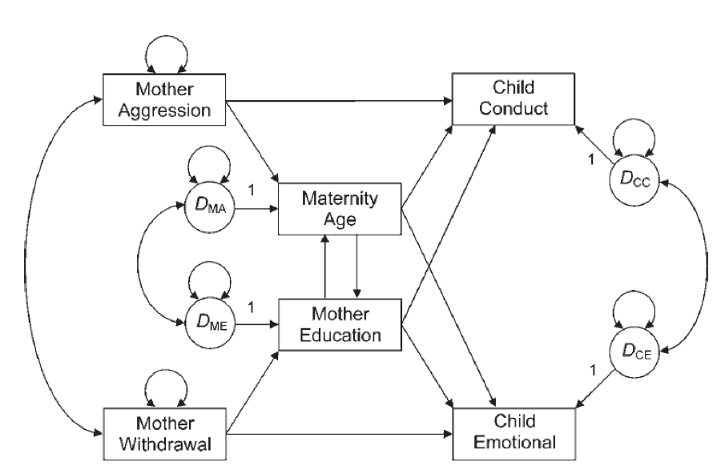

```{r setup, include=FALSE}
knitr::opts_chunk$set(echo = TRUE)
```

## Path Analysis Part 2 Practice Assignment

In the section below, you should load the `lavaan` and `semPlot` libraries. The data correlation matrix is provided for you.

```{r warning=FALSE, message=FALSE}
library(lavaan)
library(semPlot)

mother.cor <- lav_matrix_lower2full(c(1, 
                                    .19, 1, 
                                    -.16, -.20, 1, 
                                    -.37, -.06, .36, 1, 
                                    -.06, -.05, -.03, -.25, 1, 
                                    .13, -.06, -.09, -.28, .41, 1))
rownames(mother.cor) <- 
  colnames(mother.cor) <- 
  c("agg", "with", "edu", "age", "emotion", "conduct")

mother.cor
```

## Build the Model

Use the following picture as your guide for building the path model. You can download this image online from Canvas. Be sure to save it in the same folder as your markdown file. 

This model represents the relationship between maternal variables (aggression, age, education, and withdrawal) and child outcomes (conduct and emotional ability). The model predicts that child conduct and emotional capabilities are determined by interaction with the mother based on her demographics (age, education) and behavior (aggression, withdrawal). Note that the model includes a depiction of the residuals (the circles with the *D*), which you do not have to manually add in `lavaan`. However, you should correlate `~~` the residuals between the noted variables.


```{r}
model = '
conduct ~ agg + age + edu
emotion ~ age + edu + with
edu ~ with
age ~ agg
age ~~ edu
'
```

## Analyze the Model

Analyze your path model using the `sem()` function. There are 200 participants in this dataset. 

```{r}
model.fit = sem(model, sample.cov = mother.cor, sample.nobs = 200)
```

## Summarize Your Model

Use the `summary()` function to summarize your model. 

```{r}
summary(model.fit)
```

## Create a Picture

Use `semPaths()` to create a picture of your path model. 

```{r}
semPaths(model.fit, edge.label.cex = 1, whatLabels = "par", layout = "spring")
```

## Model Comparison

In a second model, you can either remove the environmental component (withdrawal and aggression) or the genetic component (age, education used as a proxy for IQ). Specify that model below.

```{r}
model2 = '
conduct ~ age + edu
emotion ~ age + edu
age ~~ edu
'

model3 = '
conduct ~ agg
emotion ~ with
'
```

## Analyze the Model

Analyze your path model using the `sem()` function. 

```{r}
model2.fit = sem(model2, sample.cov = mother.cor, sample.nobs = 200)
model3.fit = sem(model3, sample.cov = mother.cor, sample.nobs = 200)
```

## Summarize Your Model

Use the `summary()` function to summarize your model. 

```{r}
summary(model2.fit)
summary(model3.fit)
```

## Create a Picture

Use `semPaths()` to create a picture of your path model. 

```{r}
semPaths(model2.fit, edge.label.cex = 1, whatLabels = "par", layout = "spring")
semPaths(model3.fit, edge.label.cex = 1, whatLabels = "par", layout = "tree")
```

## Fit Comparison

Use the `anova()` function to compare the models directly using the chi-square difference test. Include the `fitmeasures()` of `aic` and `ecvi` to show the non-nested model comparison. 

```{r}
anova(model.fit, model2.fit, model3.fit)
fitmeasures(model.fit, c("aic", "ecvi"))
fitmeasures(model2.fit, c("aic", "ecvi"))
fitmeasures(model3.fit, c("aic", "ecvi"))
```

QUESTION: Which model is better? \
ANSWER: Model 3 has a better overall score as compared to the other 2 models. \

QUESTION: Interpret one of the loadings for your best model. What does it imply? Is it significant? \
ANSWER: Model 2 is overfitted. We should avoid those models as they do not represent the actual data. Model 3 has a better output than our initial, all inclusive model. AIC and ECVI scores also show the same results. $\chi^2$ difference shows a significant difference in the models. $\chi^2$ critial value is $5.99$ and the difference is over $8.1$